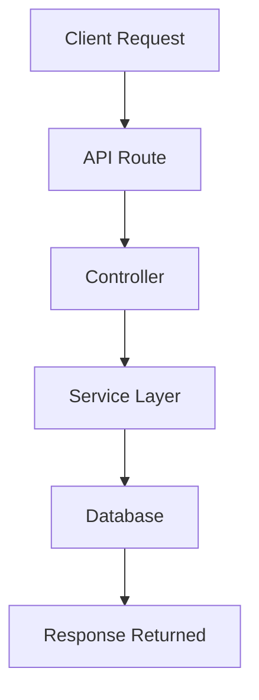
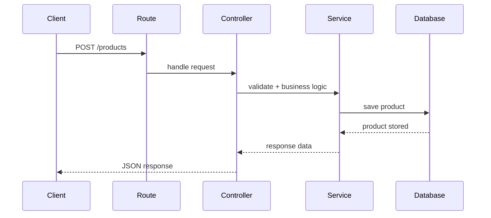

# E-Commerce-Project
Production-ready Ecommerce REST API built with Flask using JWT authentication, RBAC, Redis caching, product management, cart &amp;amp; order processing, reviews/ratings, email notifications, and secure token blacklisting.

# 🛒 E-Commerce Backend


\

A **scalable E-Commerce Backend API** built using **Python (Flask)** and designed using **Clean Architecture principles**.

The system supports a complete **online shopping workflow** including:

* Authentication & RBAC
* Product management
* Cart system
* Wishlist
* Reviews & ratings
* Order processing
* Payment status tracking
* Address management
* Email notifications
* Redis caching
* Rate limiting
* Docker containerization

---

# ✨ Core Features

## 🔐 Authentication & Security

* User registration & login
* JWT authentication
* Access & refresh tokens
* Token blacklist logout
* Forgot password via OTP
* Reset password
* Email notifications

---

## 👥 Role Based Access Control (RBAC)

The system implements **RBAC** with three roles:

| Role   | Permissions                     |
| ------ | ------------------------------- |
| Admin  | Manage users, products, orders  |
| Seller | Manage own products             |
| User   | Browse products, purchase items |

---

## 🛍 Product Management

* Create product
* Update product
* Delete product
* Upload product images
* Get product details
* Get product list

### Advanced Product Queries

* 🔍 Searching
* 📊 Sorting
* 🎯 Filtering
* 💰 Min price / Max price
* 📄 Pagination
* ⏭ Offset based queries

Example:

```
GET /products?search=laptop&min_price=1000&max_price=5000&sort=price&page=1&limit=10
```

---

## 🛒 Cart System

Users can manage their shopping cart.

Features:

* Add product to cart
* Update quantity
* Remove product
* View cart items

---

## ❤️ Wishlist

Users can store products for future purchases.

Features:

* Add to wishlist
* Remove from wishlist
* View wishlist

---

## ⭐ Reviews & Ratings

Customers can review purchased products.

Features:

* Add review
* Update review
* Delete review
* View product reviews

---

## 📦 Order Management

Handles the **checkout and order lifecycle**.

Features:

* Create order
* Order history
* Order details
* Order status tracking

Example order status:

```
PENDING
PAID
SHIPPED
DELIVERED
CANCELLED
```

---

## 💳 Payment Status

Payment system tracks order payments.

```
PENDING
SUCCESS
FAILED
REFUNDED
```

---

## 📍 Address Management

Users can manage shipping addresses.

* Add address
* Update address
* Delete address
* Get user addresses

---

## ⚡ Performance & Security

### Redis

Redis is used for:

* OTP storage
* Token blacklist
* Caching
* Rate limiting

### Rate Limiting

Prevents API abuse.

Example:

```
100 requests / minute
```

---

# 🏗 System Architecture

The project follows a **clean layered architecture**.

```
Client
  ↓
Routes
  ↓
Controllers
  ↓
Services
  ↓
Models
  ↓
Database
```

###

---

# 🔄 API Flow Diagram 



Example **Add Product Flow**



---

# 📂 Project Structure

```
ecommerce_backend/
│
├── app
│
│   ├── controllers
│   │   ├── auth_controller.py
│   │   ├── product_controller.py
│   │   ├── cart_controller.py
│   │   ├── order_controller.py
│   │   ├── wishlist_controller.py
│   │   └── review_controller.py
│
│   ├── services
│   │   ├── auth_service.py
│   │   ├── product_service.py
│   │   ├── cart_service.py
│   │   ├── order_service.py
│   │   └── review_service.py
│
│   ├── models
│   │   ├── user.py
│   │   ├── product.py
│   │   ├── cart.py
│   │   ├── order.py
│   │   └── review.py
│
│   ├── routes
│   │   ├── auth_routes.py
│   │   ├── product_routes.py
│   │   ├── cart_routes.py
│   │   ├── order_routes.py
│   │   └── wishlist_routes.py
│
│   ├── middlewares
│   │   ├── auth_middleware.py
│   │   └── rate_limit.py
│
│   ├── utils
│   │   ├── jwt_utils.py
│   │   ├── email_utils.py
│   │   └── password_utils.py
│
│   └── config
│       ├── database.py
│       └── redis_config.py
│
├── docker-compose.yml
├── requirements.txt
└── run.py
```

---

# 🔗 API Endpoints

## Authentication

| Method | Endpoint                |
| ------ | ----------------------- |
| POST   | `/auth/register`        |
| POST   | `/auth/login`           |
| POST   | `/auth/logout`          |
| POST   | `/auth/refresh-token`   |
| POST   | `/auth/forgot-password` |
| POST   | `/auth/reset-password`  |

---

## Products

| Method | Endpoint         |
| ------ | ---------------- |
| POST   | `/products`      |
| GET    | `/products`      |
| GET    | `/products/{id}` |
| PUT    | `/products/{id}` |
| DELETE | `/products/{id}` |

---

## Cart

| Method | Endpoint       |
| ------ | -------------- |
| POST   | `/cart/add`    |
| GET    | `/cart`        |
| PUT    | `/cart/update` |
| DELETE | `/cart/remove` |

---

## Wishlist

| Method | Endpoint           |
| ------ | ------------------ |
| POST   | `/wishlist/add`    |
| GET    | `/wishlist`        |
| DELETE | `/wishlist/remove` |

---

## Reviews

| Method | Endpoint                |
| ------ | ----------------------- |
| POST   | `/reviews`              |
| GET    | `/reviews/{product_id}` |
| PUT    | `/reviews/{id}`         |
| DELETE | `/reviews/{id}`         |

---

# 📥 Example API Usage

### Create Product

Request

```
POST /products
Authorization: Bearer TOKEN
```

Body

```
{
"name": "Gaming Laptop",
"description": "High performance laptop",
"price": 1500,
"stock": 10
}
```

Response

```
{
"id": 1,
"name": "Gaming Laptop",
"price": 1500,
"stock": 10
}
```

---

### Get Products with Filters

```
GET /products?search=laptop&min_price=1000&max_price=5000&page=1&limit=10
```

Response

```
{
"total": 50,
"page": 1,
"products": [...]
}
```

---

# 🐳 Running with Docker

```
docker-compose up --build
```

Services started:

* Backend API
* Redis
* Database

---

# 📧 Email Notification System

Emails are sent for:

* Registration confirmation
* Forgot password OTP
* Password reset confirmation
